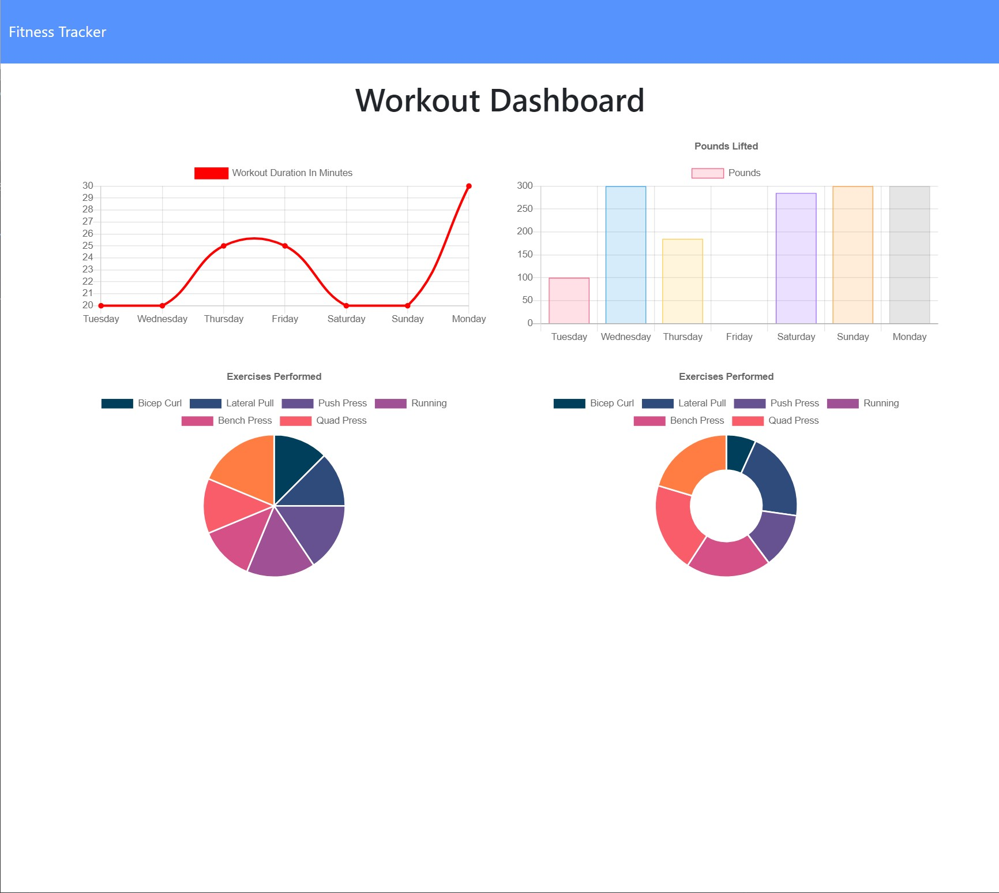

  
  # Fitness Tracker

  ## Description
  A simple exercise tracker you can use to track your fitness. Track Cardio or Resistance, enter your type, duration, weight, and distance. All inside one simple app!
  
  ## License Badge
  
  []
  
  ## Table of Contents
  
  - [Installation](#installation)
  - [Usage](#usage)
  - [Credits](#credits)
  - [License](#license)
  - [Screenshots](#screenshots)
  
  ## Installation
  
  Install using either NPM install, or run right from the online server. 
  
  ## Usage
  
  Use this program from within your web browser to track your fitness!
  
  ## Live Site
  https://mighty-lake-85486.herokuapp.com/

  ## GitHub Repo 
  https://github.com/adamnatrop/fitness_tracker

  ## License
  
  The Unlicense
  Review License terms at [http://unlicense.org/](http://unlicense.org/)
  

  ## Screenshots
  
  
  

  ## Questions
  Check out my Github for more information
  
  [adamnatrop](https://www.github.com/adamnatrop)
  
  Or email me with any questions or issues.

  

  